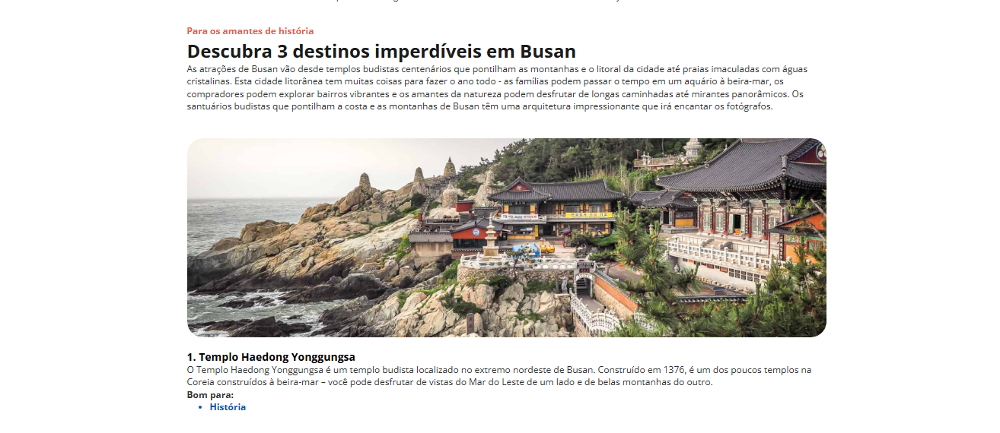
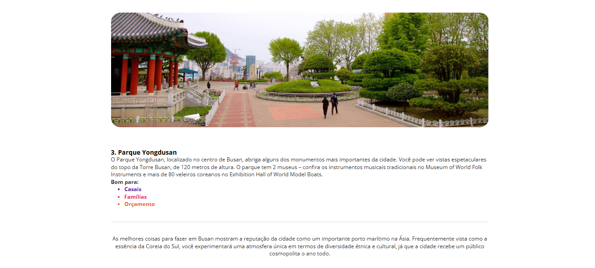

<h1 align="center" style="color: #E9967A">🌍 Descubra Busan</h1>

Desafio 01: 🌍 Descubra Busan

  <a href="#tecnologias" style="color: #FFA07A">Tecnologias</a>&nbsp;&nbsp;&nbsp;|&nbsp;&nbsp;&nbsp;
  <a href="#funcionalidades" style="color: #FFA07A">Funcionalidades</a>&nbsp;&nbsp;&nbsp;|&nbsp;&nbsp;&nbsp;
  <a href="#projeto" style="color: #FFA07A">Projeto</a>&nbsp;&nbsp;&nbsp;|&nbsp;&nbsp;&nbsp;
  <a href="#como-executar" style="color: #FFA07A">Como executar</a>&nbsp;&nbsp;&nbsp;|&nbsp;&nbsp;&nbsp;
  <a href="#licença" style="color: #FFA07A">Licença</a>

 

<h3 style="color: #E9967A">Visualização do Projeto</h3>

  

  

<h2 id="tecnologias" style="color: #CD853F">## 🛠️ Tecnologias</h2>

Este projeto foi desenvolvido com as seguintes tecnologias:

- HTML
- CSS3
- JavaScript
- Google Fonts (Open Sans)

<h2 id="funcionalidades" style="color: #CD853F">## ✨ Funcionalidades</h2>

- Interface interativa com imagens e descrições sobre Busan
- Informações sobre os principais pontos turísticos da cidade
- Seções organizadas para melhor experiência do usuário

<h2 id="projeto" style="color: #CD853F">## 🖥️ Projeto</h2>

O projeto "Descubra Busan" é uma página web informativa que apresenta os principais destinos turísticos de Busan, Coreia do Sul. Ele destaca a riqueza histórica, cultural e natural da cidade, fornecendo imagens e descrições detalhadas sobre locais icônicos como templos e parques.

<h2 id="como-executar" style="color: #CD853F">## 📑 Como executar</h2>

1. Clone este repositório para sua máquina local.
2. Abra o arquivo `index.html` em seu navegador.
3. Explore os destinos e descubra mais sobre Busan!

<h2 id="licença" style="color: #CD853F">## 📚 Licença</h2>

Esse projeto está sob a licença MIT.